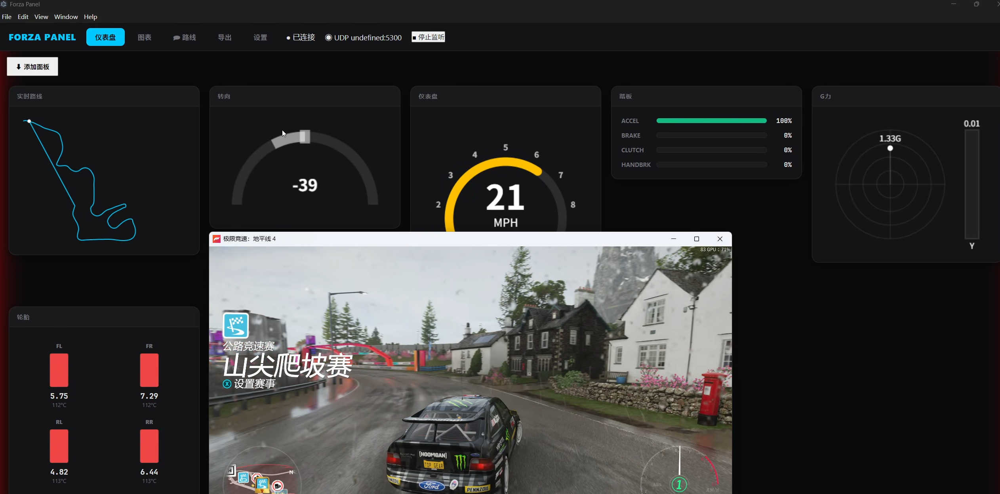
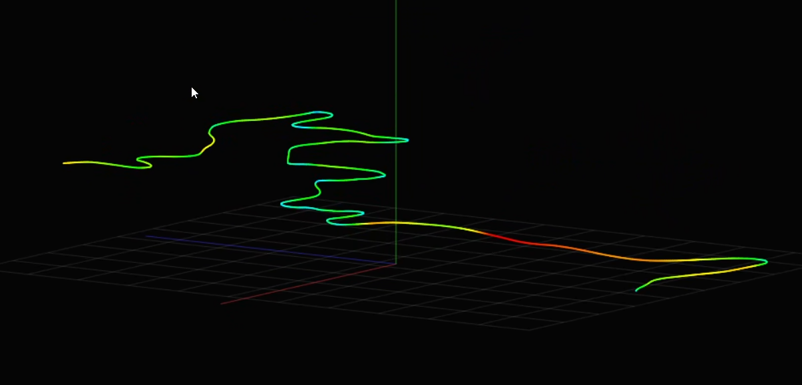

# ForzaPanel - 赛车遥测数据面板


基于 **Go** 和 **Electron** 的 Forza 系列游戏（Forza Horizon 4/5, Forza Motorsport 7/8）UDP 遥测数据监听器与实时数据面板。

能够实时获取并在仪表盘上展示你在 Forza 中的驾驶数据，提供性能分析、2D/3D 路线追踪以及数据导出与回放功能。

windows端[下载链接](https://github.com/AwayC/ForzaPanel/releases/tag/v1.0)

## 🛠️ 技术栈

- **后端**: Go (UDP Socket, WebSocket 服务)
- **前端**: Electron, Vite, TypeScript, Canvas API
- **打包**: electron-builder

## 🚀 快速开始 (开发模式)

确保你已安装了 [Node.js](https://nodejs.org/) 和 [Go 环境](https://golang.org/)。

1. **克隆项目并安装依赖**:

   ```powershell
   cd frontend
   npm install
   ```

2. **启动开发服务器**:
   ```powershell
   npm run dev
   ```
   _此命令会自动编译并启动 Go 后端服务，并在关闭 Electron 窗口时自动结束后端进程。_

## 📦 生产环境打包 (一键生成 EXE)

如果你想将项目打包为一个独立的 `.exe` 应用程序：

1. **执行打包脚本**:

   ```powershell
   cd frontend
   npm run build:win
   ```

2. **获取产物**:
   打包完成后，前往以下目录获取你的应用程序：
   - **路径**: `frontend/dist/ForzaPanel.exe`
   - **特性**: 该文件为便携版，双击即可运行，会自动管理后台 Go 服务的开启与关闭。

## 🎮 游戏配置

在 Forza 游戏中进入 **设置 (Settings)**：

- **数据输出 (Data Out)**: 开启
- **数据输出 IP (Data Out IP Address)**: `127.0.0.1` (或运行本程序的电脑 IP)
- **数据输出端口 (Data Out IP Port)**: `5300` (默认)

## 📄 项目结构

- `/backend`: Go 后端源码，负责 UDP 数据解析与 WebSocket 分发。
- `/frontend`: Electron 前端源码。
  - `/src/main`: Electron 主进程逻辑（含后端进程管理）。
  - `/src/renderer`: Vue/TS 渲染进程界面。
  - `/resources`: 存放编译后的后端二进制文件。

## 🤝 贡献

欢迎提交 Issue 或 Pull Request 来完善仪表盘组件或优化数据解析逻辑。
